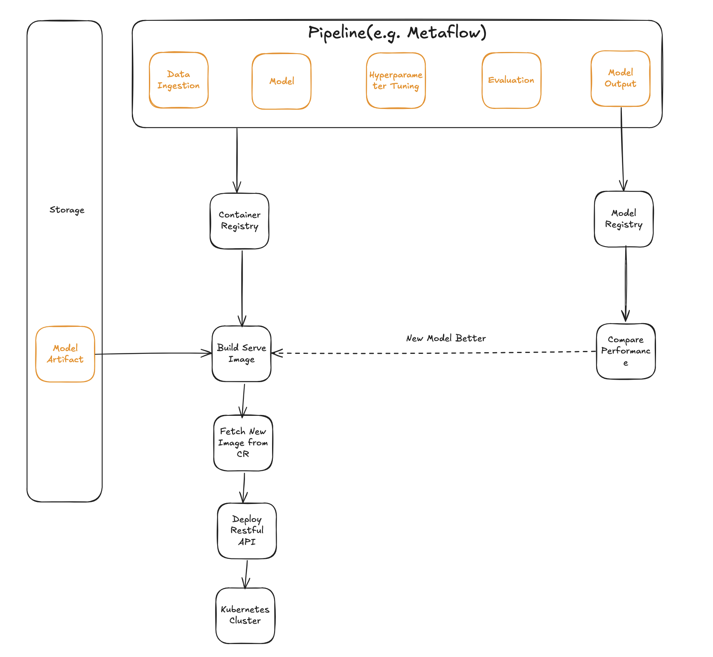
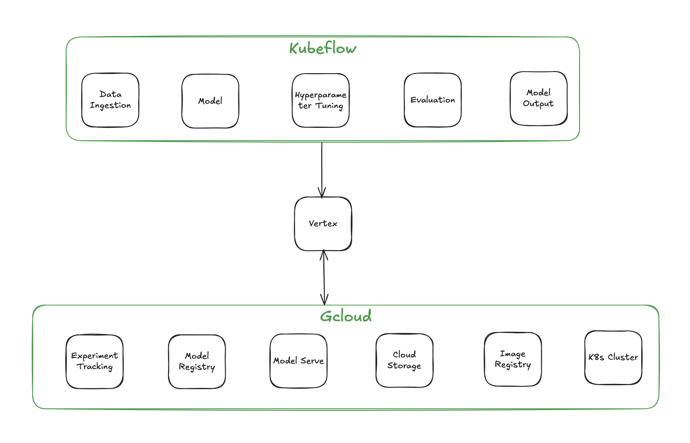
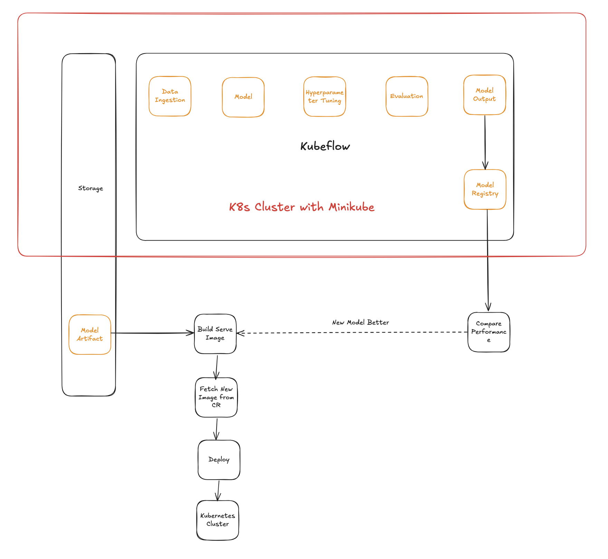

# Objective
Train and deploy a model for predicting Boston house prices.

# Requirments

- Hyperparameter tuning must be performed in parallel using Kubernetes or Vertex
- Only promote a model to production if it performs better
- Pipeline is reproducible
- Choose between Random Forest and XGBoost (RF is preferred due to a 1/3 smaller image size)
- Use MSE to measure performance
- Use Bayesian search for hyperparameter tuning
- Post-deployment prediction testing
- Assumptions
    - Real-time ML service is desired
    - Prediction service not be deployed to Kubernetes for simplicity

# Designs

## Initial Design

### Tool Selection
* Pipeline: Use Metaflow or similar tools that support vertical and horizontal scaling and parallel execution.
* Container Registry: Selected for storing and versioning container images, essential for scalable deplooyments
* Storage Component: Needed for model artifact persistent
* RESTful API: Selected for real-time serving capabilities

### Challenges
* Developing and integrating custom components from scratch demands significant development effort

## Second Design

### Tool Selection
* Google Vertex: Selected because it offers an integrated suite of ML tools and would reduce development overhead
* Kubeflow: Runs on Vertex, is framework-agnostic, integrates natively with Kubernetes, and has good documentation

### Challenges
1. Devops Complexity
    - Had to manually enable multiple services
    - Complicated authentication setup
    - Manual bucket provisioning
1. Debugging Difficulties
    - Error messages were obscured by multiple layers of abstraction
    - Container misconfiguration led to silent failures
1. Technical Limitation
    - Vertex's hyperparameter tuning API lacks support for Bayesian search, [here](https://google-cloud-pipeline-components.readthedocs.io/en/google-cloud-pipeline-components-2.14.1/api/v1/hyperparameter_tuning_job.html#v1.hyperparameter_tuning_job.HyperparameterTuningJobRunOp.study_spec_algorithm)
1. Reproducibility Issues
    - Environment setup can be heavily manual for quick prototyping

## Third Design

### Tool Selection
* Minikube: Selected for local Kubernetes clusters
    - Lightweight and easy to set up
    - Perfect for development and prototyping
    - Reduces cloud dependency
* Katib: Selected for hyperparameter tuning
    - Built for parallel execution
    - Native support for Kubernetes
    - Support Bayesian search
* Kubeflow Model Registry: Part of Kubeflow ecosystem as Katib
* FastAPI: Selected over Flask for real-time model serving
    - Future-proof with async support
* PV Storage: Selected for model artifacts
    - Native Kubernetes integration
    - Persistent data storage
    - Easy to configure and manage

# Plan and Milestones

1. ✓ Develop end-to-end training script.
1. ✓ Integrate Kubeflow with parallel hyperparameter tuning.
1. ✓ Deploy training job to Kubernetes.
1. ✓ Integrate model registry with Kubernetes.
1. ✓ Integrate PV storage with Kubernetes.
1. ✓ Implement FastAPI for model serving.
1. ✓ Set up GitHub Actions for CI/CD pipeline.

# Future
1. Automated deploy_details.json Update: When deploying a new production model, update deploy_details.json with the new model's metadata. I haven't done this. Modifying a file post-merge in GitHub is challenging, but transitioning to cloud storage will simplify the process.
1. CICD pipeline optimization: Step grouping and parallel execution implementation.
1. Refined Pipeline Triggers: Trigger based on relevant file changes, not just any changes merged to the main branch.
1. Expand Hyperparameter Search Space: Conduct more extensive searches once computational limits are addressed.
