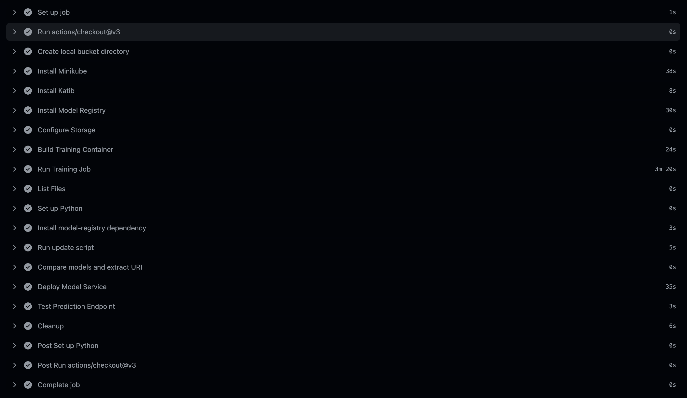
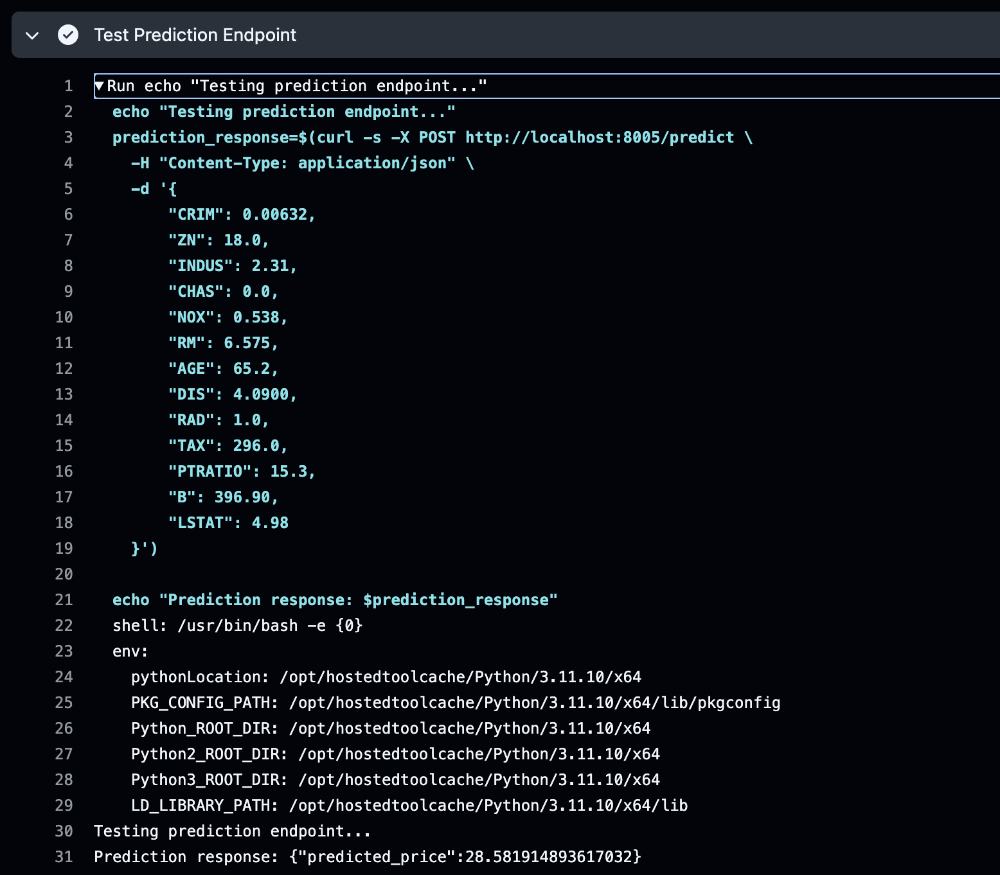
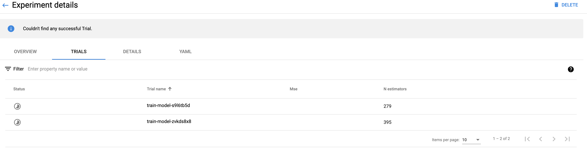
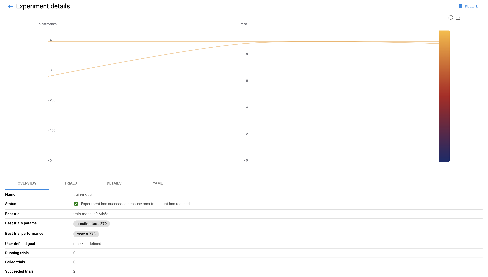

# CI/CD Pipeline Execution Screenshots
1. Setup Kubernetes with Minikube
1. Install Katib and Model Registry
1. Mount Artifact Storage
1. Activate Model Training
1. Compare Training Results
1. Deploy Model Service
1. Test Prediction Endpoint
1. Clean Up

# Katib Parallel Run Screenshot

